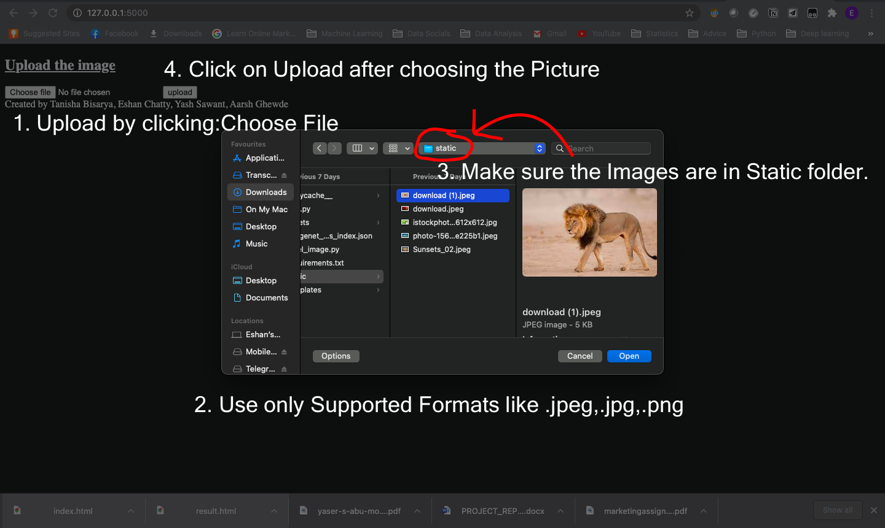
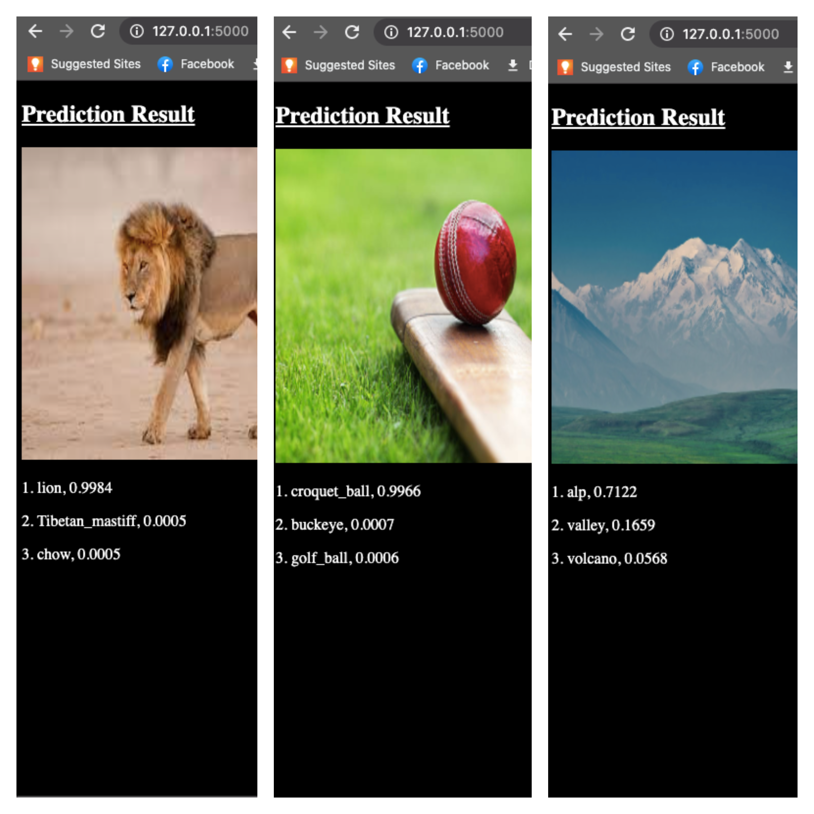

# Deep-Learning-Project-Modelling-Using-Flask-API
Here, We have made an Image classifier which gives us in return the top 3 possibilities the Object can represent. 
We have used Pytorch to build our Image Classifier
This Project has been made by Eshan Chatty, Tanisha Bisarya, Yash Sawant and Aarsh Ghewde.
## How to launch this?
``` 
cd to the drive where this repository is located.
pip install -r requirements.txt
```
## How to make the Application run?
```
Flask run
```
Go to `http://127.0.0.1:5000/` via chrome browser 
Make sure you Upload the Images by loading it from the `Static` Folder.

<p align="left"></p>

## Results

<p align="left"></p>
